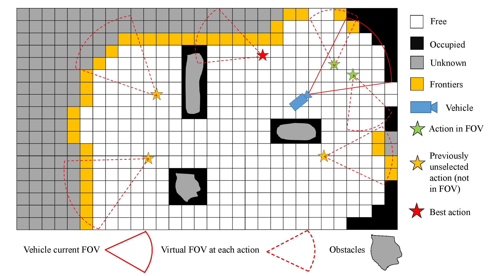
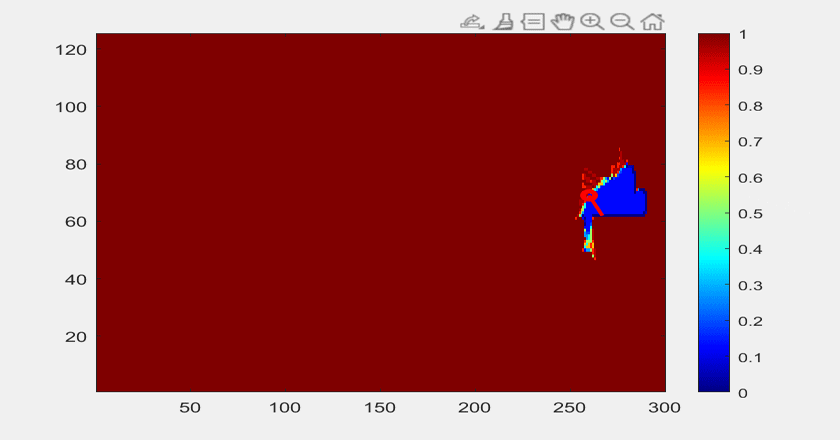
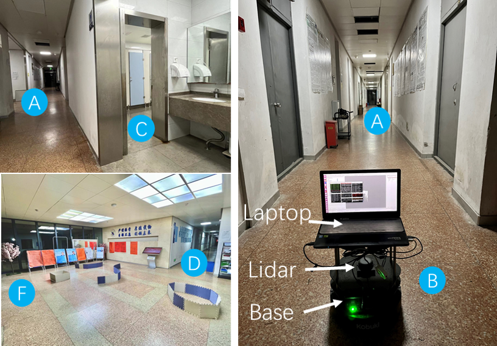
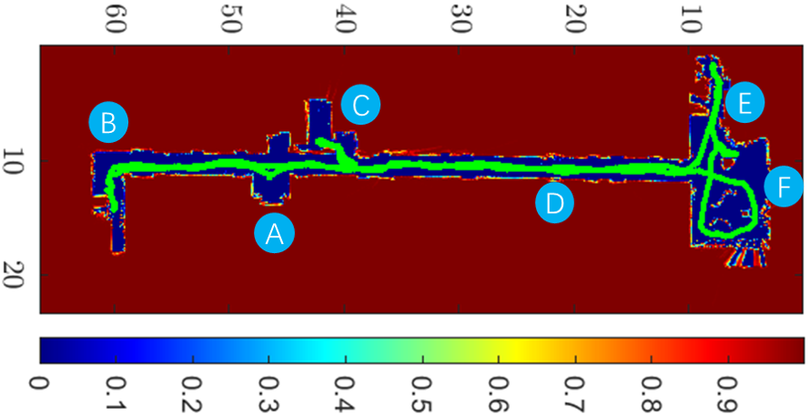

## BKIO-IPP
- An online informative path planning (IPP) framework based on Bayesian kernel inference and optimization (BKIO) for range-sensing robots;

  

- The current codes are about Naïve Greedy (NG) and Gaussian Process-based Bayesian Optimization (GPBO) methods. 

- The complete code of BKIO will be released after the paper gets accepted.

## Examples

- Seattle map dataset:

  
  
- Real-world experiments:

  

  
